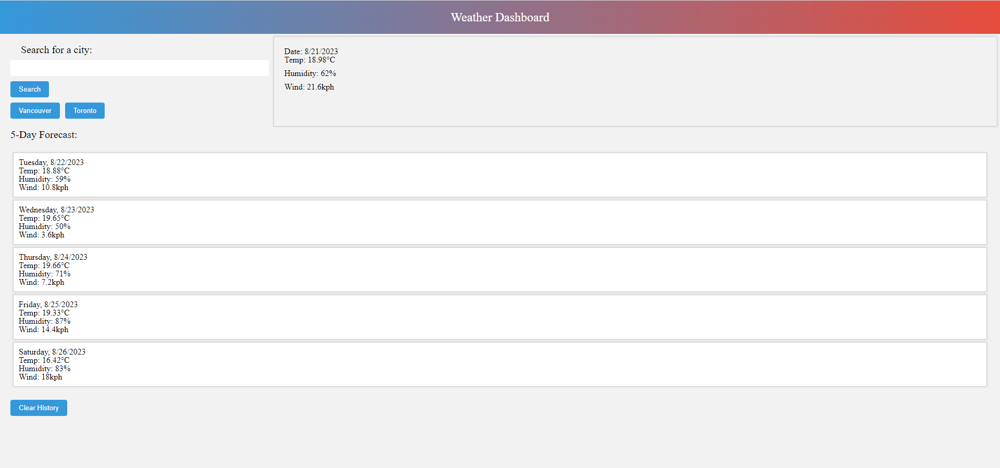

# Module 6 Project

## Description

This a code quiz project as a part of week 6 assignments for the UofT Flex Bootcamp.

## Installation

N/A

## Usage

Please visit following link to see final results

https://wesleyhas.github.io/weather-dashboard-project/

Select a city and click on search. You will be presented with a 5-day forecast for the choosen city. Data will persist on local storage so you will be able to go back to your previous searches and check the forecast again.

## Preview of Page

## Credits

N/A

## License

Please refer to the LICENSE in the repo.